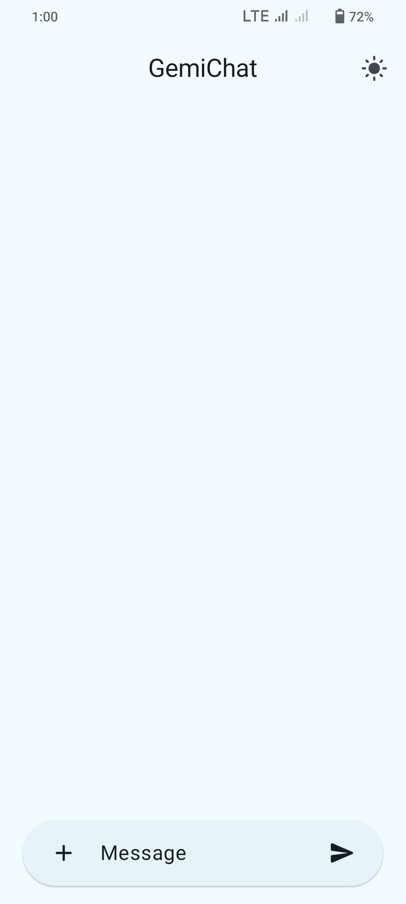
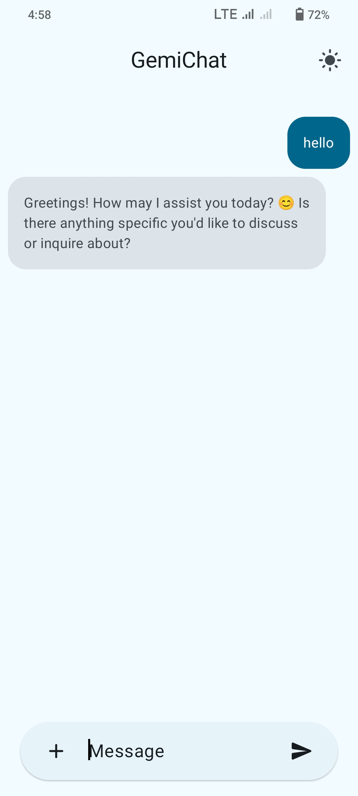
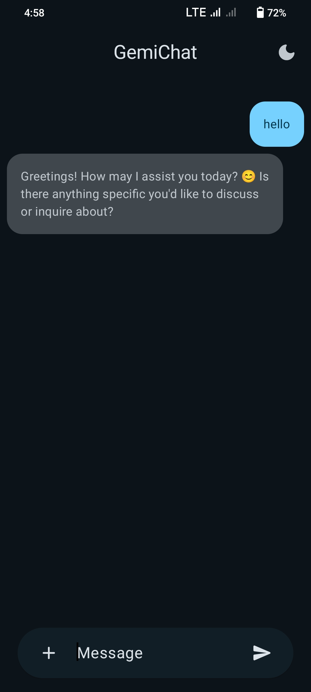
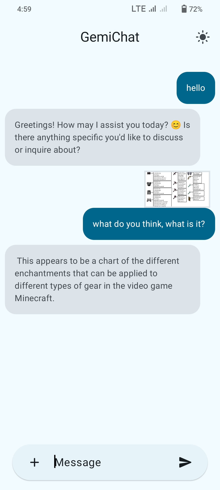

<!-- ---------- Header ---------- -->

  
  <h1>GemiChat</h1>

Gemini model based ChatBot built with Material You.

<!-- ---------- Badges ---------- -->
  

    
    
     

<!-- ---------- Description ---------- -->

## Features

- [x] Material Design 3 (You)
- [x] Dark and light theme
- [X] Gemini-pro model
- [X] Gemini-pro-vision model
- [X] Written in Jetpack Compose

<!-- ---------- Screenshots ---------- -->

## Screenshots

  
    
  
  

<!-- ---------- Contribution ---------- -->

## Building the App

***All contributions are very welcome!***

To build the app, you must use Gradle. Its highly recommended to use Android Studio for best
Experience. Also, update the Gradle version to match the one supported by your version of Android Studio.

Enter your API key in [MainViewModel
](https://github.com/meashutoshhoon/GemiChat/blob/master/app/src/main/java/com/afi/gemichat/MainViewModel.kt)

## Credits

GemiChat is a Enhanced App of [Geminichat](https://github.com/yveskalume/gemini-chat)

## License

GemiChat is licensed under the [GNU General Public License
](https://www.gnu.org/licenses/gpl.html): You can use, study and share it as you want.